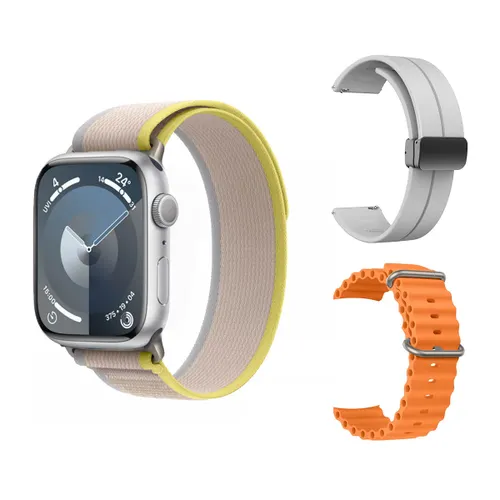

# 🛍️ zShop — A Beginner Web Development Project

A simple, fully functional multi-page e-commerce website built with **pure HTML, CSS, and JavaScript**.  
No frameworks. No libraries. No backend server. Just the fundamentals.

---

## 📖 About This Project

zShop was built as a **teaching tool** for anyone learning web development from scratch.  
The goal is to show how a real-looking website works using only the three core languages of the web:

| Language | Role |
|---|---|
| **HTML** | The structure and content of every page |
| **CSS** | All the colours, fonts, layout, and visual design |
| **JavaScript** | All the interactive behaviour (cart, forms, localStorage) |

Each file is heavily commented so beginners can read and understand exactly what every line does.

---

## 🗂️ Project Structure

```
zShop/
│
├── index.html          → Homepage with hero banner, categories & product grid
├── signup.html         → User registration page
├── signin.html         → User login page
├── cart.html           → Shopping cart page
├── checkout.html       → Checkout & payment page
│
├── style.css           → All styling for every page (one shared file)
├── script.js           → All JavaScript for every page (one shared file)
│
└── assets/
    └── images/         → All product and hero images
```

---

## 📄 Pages Overview

### 🏠 `index.html` — Homepage
- Sticky header with navigation and live cart count badge
- Hero banner section with a welcome message
- Browse by Category section (6 categories with emoji icons)
- Product grid with 54 products across multiple categories
- Promotional banner with a discount code
- Footer with quick links and contact info

### 📝 `signup.html` — Sign Up Page
- Full name, email, password, and confirm password fields
- Terms & Conditions checkbox (validated by the browser — no JS needed)
- Form validation handled by JavaScript
- User data saved to `localStorage` on successful sign-up

### 🔑 `signin.html` — Sign In Page
- Email and password fields
- "Remember me" checkbox
- Validates credentials against the saved account in `localStorage`
- Redirects to the homepage on successful login

### 🛒 `cart.html` — Shopping Cart
- Dynamically built by JavaScript — the HTML starts empty
- Lists all items added to the cart from `localStorage`
- Increase / decrease / remove item controls
- Live subtotal, shipping cost, and total calculation
- Free shipping applied automatically on orders over $20
- "Proceed to Checkout" button

### 💳 `checkout.html` — Checkout Page
- Delivery details form (name, address, city, postcode, phone)
- Payment details form (card number, expiry, CVV)
- Live order summary pulled from the cart in `localStorage`
- On successful order: cart is cleared and a success screen is shown

---

## ✨ Features

- ✅ Add to cart with a single click
- ✅ Live cart item count in the navigation bar
- ✅ Increase, decrease, or remove items in the cart
- ✅ Automatic free shipping for orders over $20
- ✅ Toast notification when an item is added to cart
- ✅ Sign up and sign in with data saved to `localStorage`
- ✅ Form validation on all forms (with helpful error messages)
- ✅ Order success screen after checkout
- ✅ Responsive design — works on desktop, tablet, and mobile
- ✅ Hamburger menu on small screens

---

## 🛠️ Technologies Used

| Technology | Purpose |
|---|---|
| **HTML5** | Page structure, semantic tags, forms |
| **CSS3** | Layout (Flexbox & Grid), animations, responsive design |
| **Vanilla JavaScript** | DOM manipulation, event handling, form validation |
| **localStorage** | Saving cart and user data in the browser (no server needed) |
| **Google Fonts** | Nunito typeface for clean, friendly typography |
| **SVG** | Scalable vector graphics used for placeholder illustrations |

---

## 🚀 How to Run the Project

No installation needed. No terminal. No server.

1. Download or clone all the project files into one folder
2. Make sure `index.html`, `style.css`, `script.js`, and the `assets/` folder are all in the **same directory**
3. Open `index.html` in any web browser (Chrome, Firefox, Edge, Safari)
4. That's it — the website works immediately!

> 💡 **Tip:** Use the [Live Server extension](https://marketplace.visualstudio.com/items?itemName=ritwickdey.LiveServer) in VS Code for a better development experience with auto-reload.

---

## 🎓 How to Use This Project for Teaching

This project is designed so that you can **turn features on and off** to demonstrate what each technology does.

---

### 🔌 Lesson 1 — What is HTML?

Open `index.html` and **remove (or comment out) both of these lines:**

```html
<link rel="stylesheet" href="style.css" />
```
```html
<script src="script.js"></script>
```

Save and refresh the browser.  
You will now see **raw HTML** — plain text, no colours, no layout, no buttons working.  
This perfectly answers: *"What does HTML look like on its own?"*

---

### 🎨 Lesson 2 — What does CSS do?

Put the CSS link back:
```html
<link rel="stylesheet" href="style.css" />
```

Leave the script tag **removed**.  
Now the page looks beautiful — colours, fonts, layout all work.  
But clicking "Add to Cart" does nothing, the cart count stays at 0.  
This answers: *"What does CSS do? And what does it NOT do?"*

---

### ⚙️ Lesson 3 — What does JavaScript do?

Put the script tag back:
```html
<script src="script.js"></script>
```

Now everything works — buttons, cart, toast notifications, forms.  
This answers: *"What does JavaScript add to a page?"*

---

### 📦 Lesson 4 — What is localStorage?

Open your browser's **Developer Tools** (press `F12`).  
Go to **Application → Local Storage → localhost** (or your file path).  
Add an item to the cart and watch `shoplearn_cart` appear and update in real time.  
Close the tab, reopen it — the cart data is still there!  
This demonstrates: *"How does a website remember data without a server?"*

---

## 🏗️ How the Cart Works (Step by Step)

1. User clicks **"Add to Cart"** on a product
2. The button's `data-id`, `data-name`, and `data-price` attributes are read by JavaScript
3. JavaScript checks if that product already exists in the cart array
4. If yes — the quantity increases by 1
5. If no — a new item object is added to the array
6. The updated cart array is saved to `localStorage` as a JSON string
7. The cart count badge in the nav bar is updated
8. A green toast notification pops up for 2.5 seconds

---

## 📁 Image Assets

All product images are stored in `assets/images/`.  
They are organised by product category:

| Category | Image files |
|---|---|
| Hero banners | `hero-image.webp`, `hero-img1.jpg`, `hero-img2.jpg`, `hero-img3.jpg` |
| Earbuds | `wireless-earbud-pro.webp`, `airpods_pro_3.webp` |
| Speakers | `bassBox-bluetooth-speaker.webp` → `bassBox-bluetooth-speaker6.webp` |
| Smart Watches | `smart-watch.webp` → `smart-watch5.webp`, `smartWatch.jpg` |
| Phones & Tech | `iphone17.jpg`, `asus-vivoBook.jpg`, `power-bank.jpg` |
| Shoes | `AeroRun-Shoes.webp`, `AeroRun-Shoes2.webp`, `AeroRun-Shoes3.webp`, `sneakers.jpg` |
| Backpacks | `urban-explorer-backpack.webp` → `urban-explorer-backpack4.webp` |
| LED Lamps | `LED-Desk-Lamp.webp` → `LED-Desk-Lamp5.webp` |
| Skincare | `glow-face-moisturiser.webp` → `glow-face-moisturiser6.webp` |
| Beauty | `beauty-care.jpg`, `brushPack.jpg` |
| Notebooks | `premium-notebook-set.webp` → `premium-notebook-set9.webp` |
| Appliances | `airFryer.jpg`, `blender.jpg`, `fan.jpg`, `pressing-iron.jpg` |

To replace any placeholder image with a real one, simply change the `src` attribute in the relevant product card:
```html
<!-- Change this: -->


<!-- To this (your own image): -->

```

---

## ⚠️ Important Notes

- **No real payments are processed.** The checkout form is for learning only. Never collect real card details on a static HTML site.
- **No real server or database** is used. All data (cart, user account) is stored in the browser's `localStorage` and will be cleared if the user clears their browser data.
- **Passwords are not stored securely.** In this project, for simplicity, only the user's name and email are saved. In a real application, passwords must be hashed on a secure server — never stored in plain text or localStorage.
- This project is intended **for educational purposes only** and is not production-ready.

---

## 📚 What to Learn Next

Once you are comfortable with this project, here are great next steps:

1. **CSS Flexbox & Grid** — understand the layout system used in `style.css`
2. **JavaScript DOM Manipulation** — read through `script.js` function by function
3. **Responsive Web Design** — study the `@media` queries at the bottom of `style.css`
4. **HTML Forms & Validation** — experiment with adding new fields to the forms
5. **Fetch API & REST APIs** — replace `localStorage` with real server calls
6. **Node.js / Express** — build a real backend to handle users and orders
7. **React or Vue** — learn a JavaScript framework to build bigger projects faster

---

## 👨‍💻 Built By

**zShop** was created as a hands-on learning project for teaching the basics of web development — HTML structure, CSS styling, and JavaScript interactivity — from absolute zero.

---

*© 2026 zShop — Built for the purpose of learning HTML, CSS, and JavaScript.*